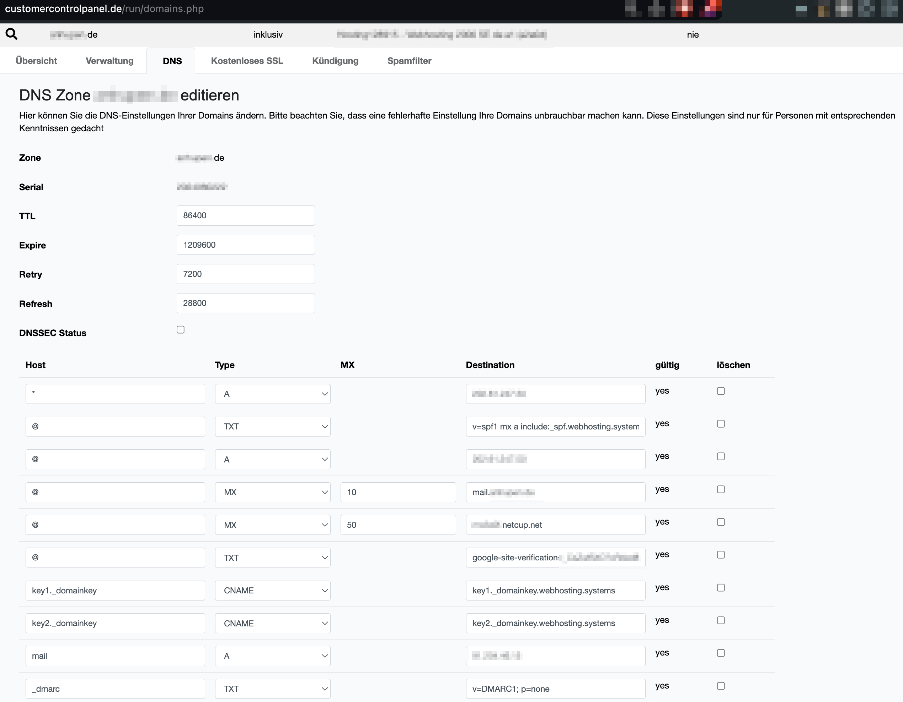

# netcup DNS former
Manage your [netcup](https://www.netcup.de) DNS settings with [Terraform](https://www.terraform.io).

In main.tf you can find the DNS settings that I mostly use. Feel free to add yours by copying them from the netcup domain DNS settings

# Get started
First, you need to create your netcup api key and password here: https://www.customercontrolpanel.de/run/daten_aendern.php?sprung=api

Then export these three variables

- NETCUP_API_KEY
- NETCUP_API_PASS
- NETCUP_CUSTOMER_NUMBER

and supply them when executing the commands like this

	terraform COMMAND -var="key=$NETCUP_API_KEY" -var="password=$NETCUP_API_PASS" -var="customer_number=$NETCUP_CUSTOMER_NUMBER"

create a yourdomain.tfvars file with these contents

	domain = "yourdomain.de"
	server_ip = "ip-of-your-server"
	mail_server = "e.g. mxaaaa.netcup.net"
	webhosting_ip = "ip-of-your-webhosting-with-email"

then run

	terraform init
	terraform plan
	terraform apply

And see the new entries appear. If some were present already, they won't be changed at first. They will still be managed with Terraform. If you're not adding all you DNS entries for one domain, you won't be able to manage them here.

# Log
You can see the activity log in netcup here: https://www.customercontrolpanel.de/run/domains_apilog.php
